<!--
File: README.md
Document Title: Artisan Developer — Static Portfolio Theme
Author: Alysha Pursley
Date: July 2026
-->

<div align="center">

# Artisan Developer — Static Portfolio Theme

**Static GitHub Pages portfolio theme with a distinctive developer-focused interface and customizable portfolio pages.**

[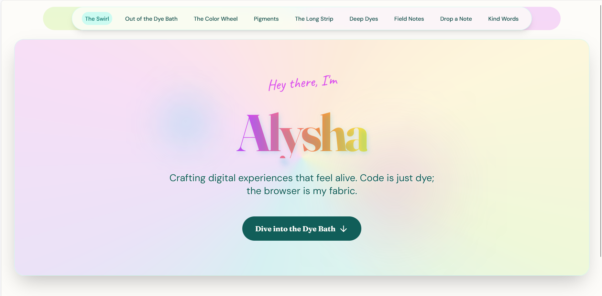](images/screenshots/artisan-developer-screenshot-01.png)

[Open the live demo](https://apursley2012.github.io/artisan-developer/) · [Browse the full theme collection](https://github.com/apursley2012/github-pages-themes) · [Report an issue or request an addition](https://github.com/apursley2012/artisan-developer-github-pages-theme/issues/new/choose)

</div>

---

## Table of Contents

- [Theme Overview](#theme-overview)
  - [Purpose](#purpose)
  - [Intended Users](#intended-users)
  - [Design Style and Inspiration](#design-style-and-inspiration)
  - [Main Color Palette](#main-color-palette)
  - [Preview Screenshots](#preview-screenshots)
- [Pages Included](#pages-included)
- [Component Architecture](#component-architecture)
  - [Shared Theme Components](#shared-theme-components)
  - [Shared Site Assets](#shared-site-assets)
  - [Theme-Specific Interactive Behavior](#theme-specific-interactive-behavior)
- [File and Folder Structure](#file-and-folder-structure)
- [Static Project Notes](#static-project-notes)
- [Customization Guide](#customization-guide)
- [GitHub Pages Deployment](#github-pages-deployment)
- [Reporting Theme Issues or Requesting Additions](#reporting-theme-issues-or-requesting-additions)
- [Accessibility and Browser Compatibility](#accessibility-and-browser-compatibility)
- [Repository Relationship](#repository-relationship)
- [Custom Theme Requests](#custom-theme-requests)
- [Possible Future Enhancements](#possible-future-enhancements)
- [Copyright](#copyright)

---

<details open>
<summary>Theme overview, purpose, audience, design choices, palette, and previews</summary>

## Theme Overview

### Purpose

I designed **Artisan Developer** as a static portfolio theme with a strong visual identity and a practical page structure. I wanted it to feel more memorable than a plain template while still being simple enough for someone to customize.

This theme is meant to work as a complete static portfolio that can be opened locally, edited in a basic code editor, previewed in SPCK Editor, and published through GitHub Pages. I built the structure around the pages most portfolio sites usually need: a homepage, about page, projects, skills, work experience, writing or case studies, testimonials, and contact information.

### Intended Users

This theme is for developers, students, designers, writers, creative technologists, freelancers, and anyone who wants a portfolio with a stronger identity than a plain starter template. It is especially useful for people who want a site that feels designed, but still want the files to stay simple enough to edit without a complicated build process.

The theme is also approachable for beginners. The site is already static, so the person using it does not need to run a server, install a database, or understand a deployment pipeline before publishing it.

### Design Style and Inspiration

Category: **Developer and Portfolio**

I started with the core portfolio tasks: introduce the owner, show projects, explain skills, provide writing or case studies, and make contact easy. The visual system was built around those tasks instead of forcing the content into a random layout.

The page structure uses repeated cards, headings, and navigation patterns so visitors can move through the site without guessing. That consistency is especially important for portfolios because the design should support the work, not compete with it.

Cursor effects were kept decorative and lightweight. They add personality, but they should never be required for navigation or understanding the page.

Page transitions are intentionally short. Motion can make a site feel polished, but it should not slow the visitor down or make the interface feel heavy.

The main design goal was to keep the theme expressive while still respecting usability basics: clear navigation, readable text, consistent spacing, sufficient contrast, and content blocks that can be scanned quickly. A portfolio should show personality, but it should also help visitors understand the work without getting lost.

### Main Color Palette

The theme styling uses the following colors from the actual CSS files:

| Color | Primary Use |
| --- | --- |
| `#0000` | Backgrounds and large visual surfaces |
| `#FDFCF9` | Primary text, high-contrast elements, or light panel details |
| `#06B6D4` | Accent color for links, highlights, buttons, or visual emphasis |
| `#FFFFFF` | Secondary accent for cards, borders, gradients, or decorative elements |
| `#9CA3AF` | Depth color for shadows, panels, and layered interface areas |
| `#FDFCF9CC` | Backgrounds and large visual surfaces |
| `#D946EF1A` | Primary text, high-contrast elements, or light panel details |
| `#D946EF33` | Accent color for links, highlights, buttons, or visual emphasis |
| `#8B5CF6` | Secondary accent for cards, borders, gradients, or decorative elements |
| `#D946EF` | Depth color for shadows, panels, and layered interface areas |
| `#FB7185` | Backgrounds and large visual surfaces |
| `#FB923C` | Primary text, high-contrast elements, or light panel details |

### Preview Screenshots

Click any preview image to open the full-size file.

<details open>
<summary>Screenshot gallery</summary>

<p align="center">
  
  &nbsp;&nbsp;
  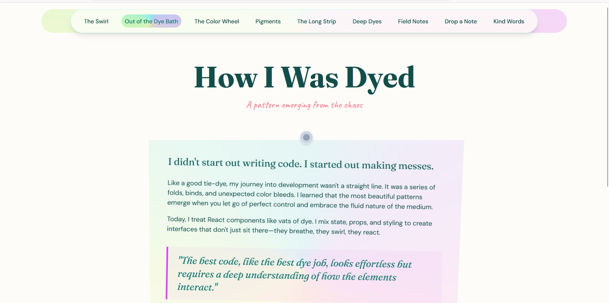
</p>
<p align="center">
  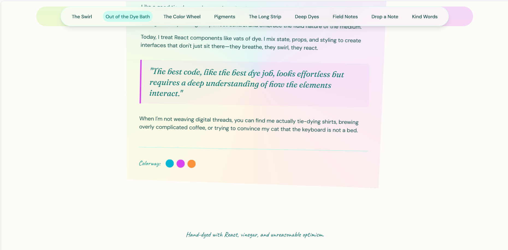
  &nbsp;&nbsp;
  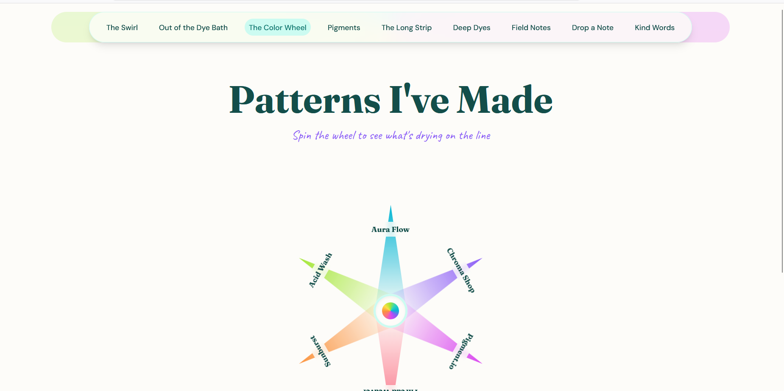
</p>
<p align="center">
  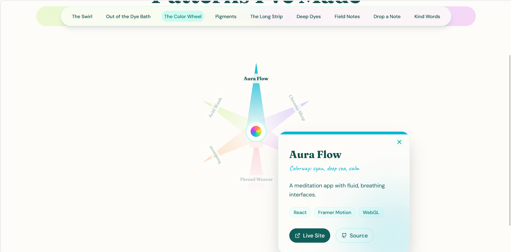
  &nbsp;&nbsp;
  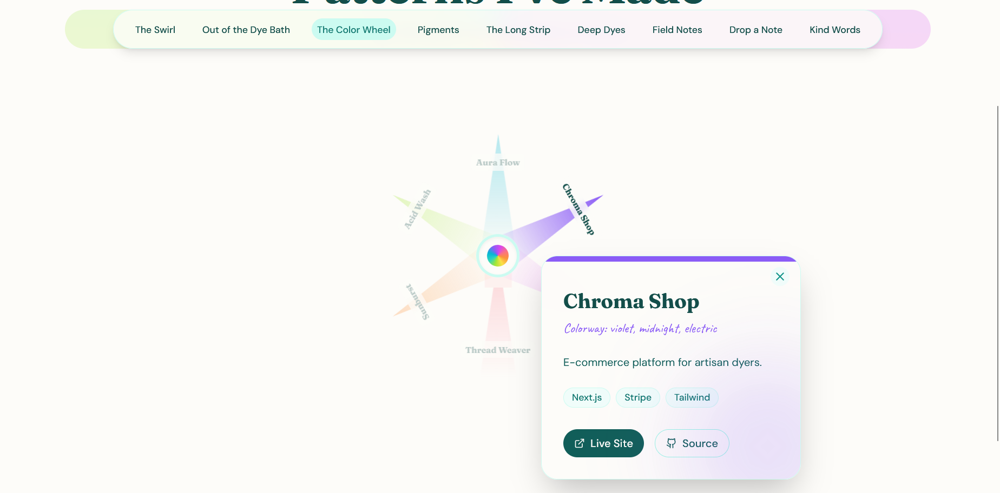
</p>
<p align="center">
  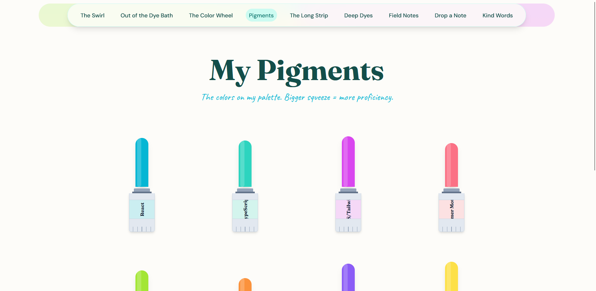
  &nbsp;&nbsp;
  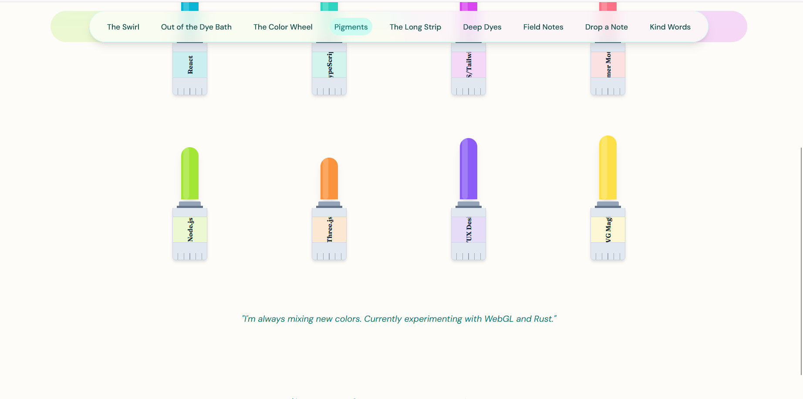
</p>
<p align="center">
  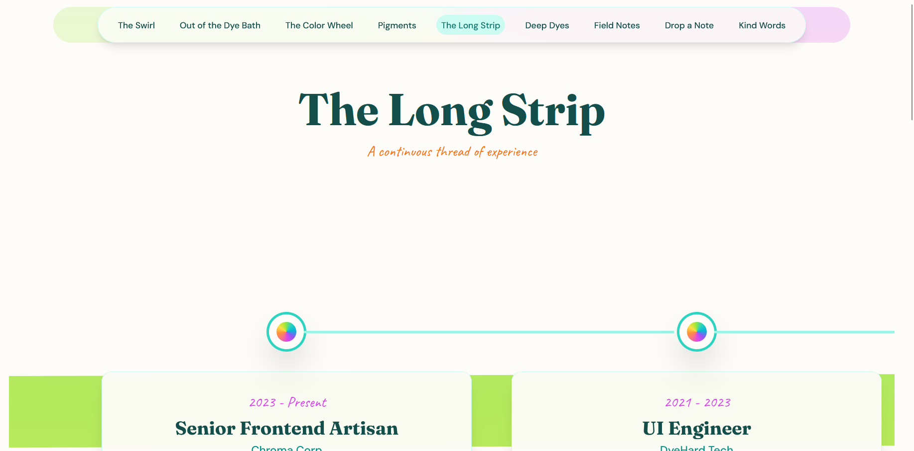
  &nbsp;&nbsp;
  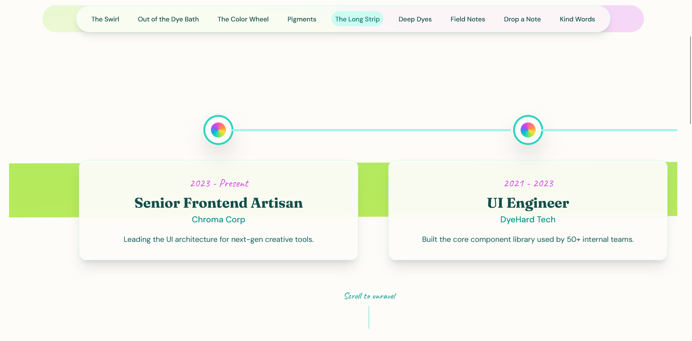
</p>
<p align="center">
  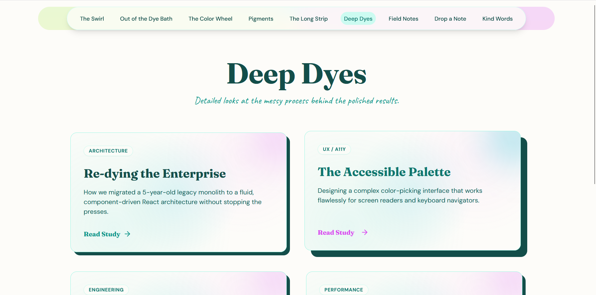
  &nbsp;&nbsp;
  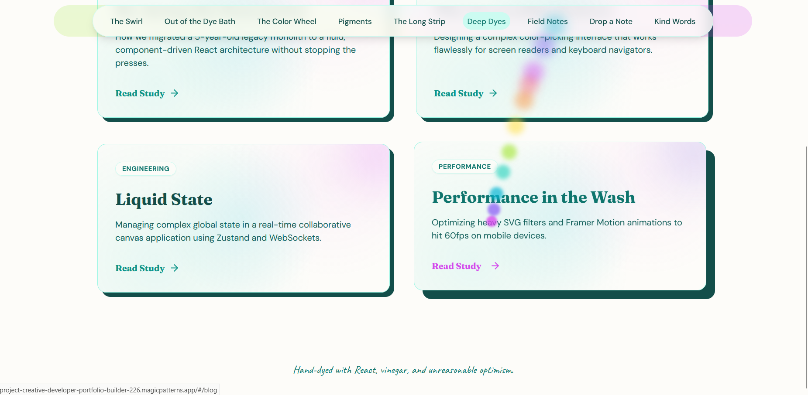
</p>
<p align="center">
  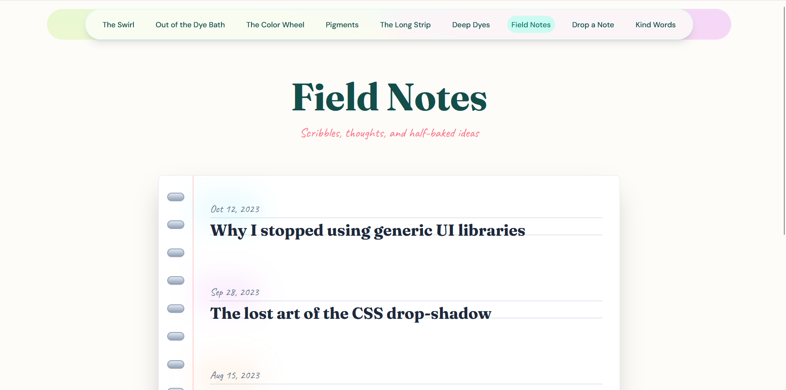
  &nbsp;&nbsp;
  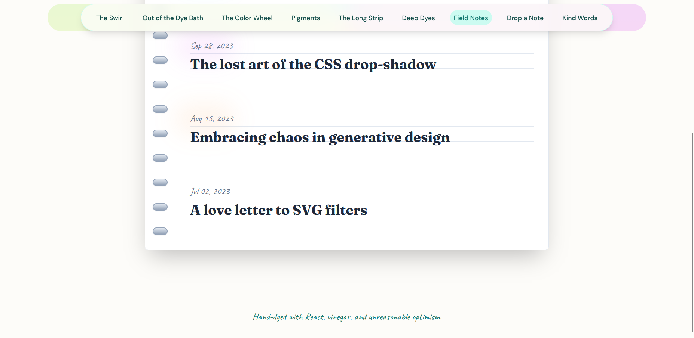
</p>
<p align="center">
  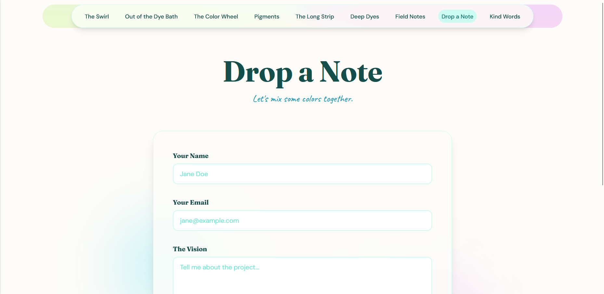
  &nbsp;&nbsp;
  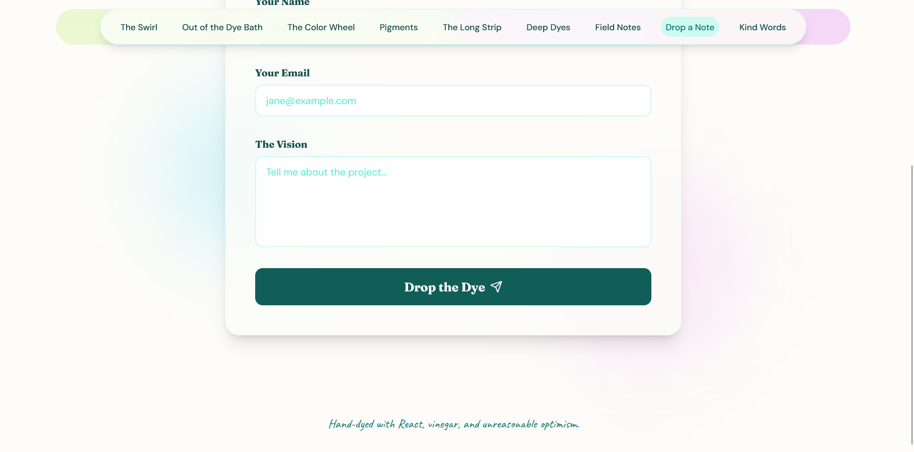
</p>
<p align="center">
  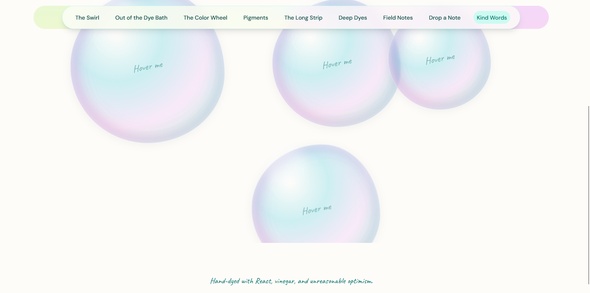
  &nbsp;&nbsp;
  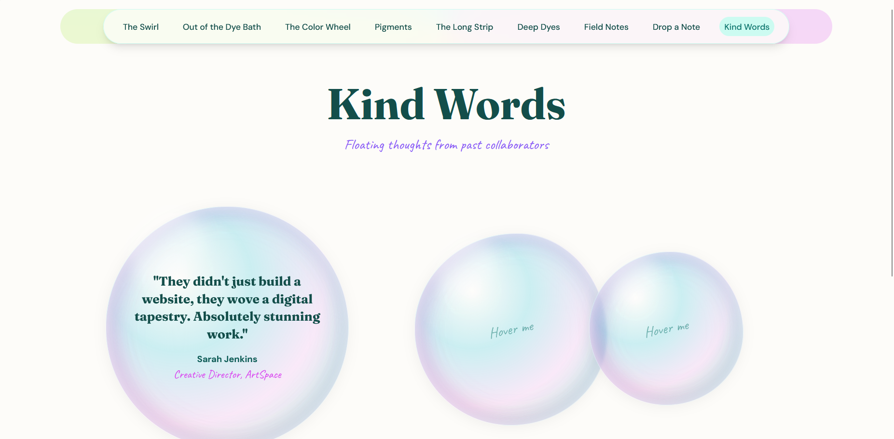
</p>
<p align="center">
  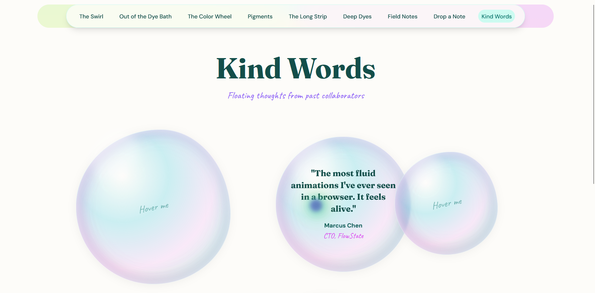
</p>

[Open the screenshot folder](./images/screenshots/)

</details>

---


</details>

<details open>
<summary>Pages included in the static theme</summary>

## Pages Included

The portfolio pages are kept as separate static HTML entry files.

| Page | Purpose |
| --- | --- |
| `index.html` | Main homepage and GitHub Pages entry file |
| `pages/About.html` | Biography, background, and personal introduction page |
| `pages/Blog.html` | Writing archive, article index, or long-form content page |
| `pages/CaseStudies.html` | Detailed case studies and technical breakdowns |
| `pages/Contact.html` | Contact details and communication links |
| `pages/Projects.html` | Featured project portfolio and project summaries |
| `pages/Skills.html` | Skills, technologies, and capability overview |
| `pages/Testimonials.html` | Testimonials and feedback page |
| `pages/Work.html` | Professional experience and work history |

`index.html` is the homepage and GitHub Pages entry file. It should stay at the repository root.

---


</details>

<details open>
<summary>Components, assets, and interactive behavior</summary>

## Component Architecture

### Shared Theme Components

| Component | Purpose |
| --- | --- |
| `components/ColorWheel.js` | Provides the **Color Wheel** interface piece used by this theme, giving that part of the page its own visual treatment while staying inside the shared layout system. |
| `components/DyeCursor.js` | Controls the decorative cursor behavior used by the theme while keeping the actual links and buttons usable with normal pointer interaction. |
| `components/FabricStripTimeline.js` | Presents work, project, or experience entries in a chronological layout that is easier to scan than a loose block of text. |
| `components/KineticHeadline.js` | Provides the **Kinetic Headline** interface piece used by this theme, giving that part of the page its own visual treatment while staying inside the shared layout system. |
| `components/MarbledCard.js` | Creates reusable card-style content blocks for projects, skills, or supporting details while preserving consistent spacing and hierarchy. |
| `components/PageTransition.js` | Wraps page content in short transition effects so navigation feels smoother while still keeping the site responsive. |
| `components/PaintTube.js` | Provides the **Paint Tube** interface piece used by this theme, giving that part of the page its own visual treatment while staying inside the shared layout system. |
| `components/SoapBubble.js` | Provides the **Soap Bubble** interface piece used by this theme, giving that part of the page its own visual treatment while staying inside the shared layout system. |
| `components/SwirlNav.js` | Provides the **Swirl Nav** interface piece used by this theme, giving that part of the page its own visual treatment while staying inside the shared layout system. |
| `components/TieDyeSwirl.js` | Provides the **Tie Dye Swirl** interface piece used by this theme, giving that part of the page its own visual treatment while staying inside the shared layout system. |

### Shared Site Assets

| Asset | Purpose |
| --- | --- |
| `assets/createLucideIcon.js` | Compiled JavaScript support file used by the static build for shared rendering, animation, or component behavior. |
| `assets/index.js` | Compiled JavaScript support file used by the static build for shared rendering, animation, or component behavior. |
| `assets/index2.js` | Compiled JavaScript support file used by the static build for shared rendering, animation, or component behavior. |
| `assets/jsx-runtime.js` | Compiled JSX runtime helper used by the static build so the JavaScript components can render correctly in the browser. |
| `assets/main.css` | Main stylesheet for the theme, including the responsive layout, typography, color system, spacing, page backgrounds, and visual details. |
| `assets/main.js` | Main JavaScript entry file for the static build. It initializes the page interface and connects the shared components to the HTML entry files. |
| `assets/proxy.js` | Shared compiled helper bundle used by the static JavaScript files to support rendering and imported utilities. |
| `assets/x.js` | Compiled JavaScript support file used by the static build for shared rendering, animation, or component behavior. |

### Theme-Specific Interactive Behavior

<details open>
<summary>Interactive behavior included in this theme</summary>

- `components/ColorWheel.js`: Provides the **Color Wheel** interface piece used by this theme, giving that part of the page its own visual treatment while staying inside the shared layout system.
- `components/DyeCursor.js`: Controls the decorative cursor behavior used by the theme while keeping the actual links and buttons usable with normal pointer interaction.
- `components/FabricStripTimeline.js`: Presents work, project, or experience entries in a chronological layout that is easier to scan than a loose block of text.
- `components/KineticHeadline.js`: Provides the **Kinetic Headline** interface piece used by this theme, giving that part of the page its own visual treatment while staying inside the shared layout system.
- `components/MarbledCard.js`: Creates reusable card-style content blocks for projects, skills, or supporting details while preserving consistent spacing and hierarchy.
- `components/PageTransition.js`: Wraps page content in short transition effects so navigation feels smoother while still keeping the site responsive.
- `components/PaintTube.js`: Provides the **Paint Tube** interface piece used by this theme, giving that part of the page its own visual treatment while staying inside the shared layout system.
- `components/SoapBubble.js`: Provides the **Soap Bubble** interface piece used by this theme, giving that part of the page its own visual treatment while staying inside the shared layout system.
- `components/SwirlNav.js`: Provides the **Swirl Nav** interface piece used by this theme, giving that part of the page its own visual treatment while staying inside the shared layout system.
- `components/TieDyeSwirl.js`: Provides the **Tie Dye Swirl** interface piece used by this theme, giving that part of the page its own visual treatment while staying inside the shared layout system.

The interactive details are meant to support the theme, not replace the content. Decorative motion should remain lightweight, readable, and secondary to navigation and portfolio information.

</details>

---


</details>

<details open>
<summary>Full repository file and folder structure</summary>

## File and Folder Structure

<details>
<summary>View repository structure</summary>

```text
artisan-developer-github-pages-theme/
├── .nojekyll
├── assets/createLucideIcon.js
├── assets/index.js
├── assets/index2.js
├── assets/jsx-runtime.js
├── assets/main.css
├── assets/main.js
├── assets/proxy.js
├── assets/x.js
├── components/ColorWheel.js
├── components/DyeCursor.js
├── components/FabricStripTimeline.js
├── components/KineticHeadline.js
├── components/MarbledCard.js
├── components/PageTransition.js
├── components/PaintTube.js
├── components/SoapBubble.js
├── components/SwirlNav.js
├── components/TieDyeSwirl.js
├── images/screenshots/artisan-developer-screenshot-01.png
├── images/screenshots/artisan-developer-screenshot-02.png
├── images/screenshots/artisan-developer-screenshot-03.png
├── images/screenshots/artisan-developer-screenshot-04.png
├── images/screenshots/artisan-developer-screenshot-05.png
├── index.html
├── pages/About.html
├── pages/Blog.html
├── pages/CaseStudies.html
├── pages/Contact.html
├── pages/Projects.html
├── pages/Skills.html
├── pages/Testimonials.html
├── pages/Work.html
```

The folders work together as follows:

- `index.html` is the homepage and GitHub Pages entry file.
- `pages/` contains the other static portfolio pages when the folder is included.
- `components/` contains reusable interface behavior and themed visual elements.
- `assets/` contains the compiled JavaScript, stylesheet, and supporting files.
- `images/screenshots/` stores the repository preview images.
- `.nojekyll` tells GitHub Pages to publish the files directly.

</details>

---


</details>

<details open>
<summary>Static hosting notes</summary>

## Static Project Notes

This project is designed for direct static hosting.

- The homepage is `index.html`.
- Portfolio sections are available through the root page and the files inside `pages/`.
- Shared styles and scripts stay organized inside their existing folders.
- Internal file paths use GitHub-compatible relative paths.
- No build step is required for the published static version.
- No database or backend service is required.
- The `.nojekyll` file should stay beside `index.html`.

---


</details>

<details open>
<summary>Customization guide</summary>

## Customization Guide


<details>
<summary>Customization guide</summary>

### Personal Information and Branding

Start with `index.html` and the files in `pages/`. Update the portfolio-owner name, homepage introduction, professional headline, and any themed labels that should reflect the person using the theme.

### Biography and Life Story

Use the About page for background information, career goals, education, personal story, and the kind of work the portfolio owner wants to be known for. I designed this section to be readable first and decorative second, because biography content needs room to breathe.

### Projects, Skills, Services, and Experience

Project and experience sections should stay organized in short, scannable blocks. This follows basic information architecture: visitors should be able to understand the portfolio quickly, then choose where to read more.

Common editing locations include:

- `pages/Projects.html` for featured work
- `pages/Skills.html` for skills and tools
- `pages/Work.html` for professional experience
- `pages/CaseStudies.html` for deeper project writeups
- `pages/Blog.html` or article pages for writing
- `pages/Testimonials.html` for feedback

### Contact Information and Social Links

Update the Contact page before publishing. Add the correct email, GitHub, LinkedIn, portfolio, résumé, or preferred contact method. Contact information should be easy to find because the portfolio is not only a visual piece; it is also a practical way for people to reach the owner.

### Images and Screenshots

Repository screenshots live in:

```text
images/screenshots/
```

Use clear filenames and keep the paths lowercase where possible. This README already points to the screenshot folder so the repository preview works cleanly on GitHub.

### Colors, Fonts, and Styling

Most visual changes should be made in `assets/main.css`. Color changes are safest when handled in small groups instead of rewriting the whole stylesheet at once. That preserves the layout system, responsive spacing, and contrast decisions that keep the theme usable.

### Navigation

Test every navigation link after editing. GitHub Pages is case-sensitive, so `About.html` and `about.html` are not treated as the same file. Keep links relative instead of starting paths with `/`.

For the homepage, use:

```html
<a href="./index.html">Home</a>
```

### Theme-Specific Editing Checklist

1. Update the homepage name, headline, and introduction.
2. Replace the About, Projects, Skills, Work, Writing, Testimonials, and Contact content that applies to the portfolio.
3. Keep the page hierarchy clear: title first, short explanation second, supporting details after that.
4. Replace screenshots in `images/screenshots/` after the design is customized.
5. Test the site locally, in SPCK Editor when applicable, and through GitHub Pages.
6. Keep `.nojekyll` at the root beside `index.html`.
7. Avoid root-based paths that start with `/` unless the site is being hosted from the domain root.

</details>


---


</details>

<details open>
<summary>GitHub Pages deployment guide</summary>

## GitHub Pages Deployment


<details>
<summary>GitHub Pages deployment guide</summary>

### Required Repository Structure

Upload the theme files so `index.html` sits directly at the repository root.

Correct:

```text
artisan-developer-github-pages-theme/
├── .nojekyll
├── index.html
├── assets/
├── components/
├── pages/
└── README.md
```

Incorrect:

```text
artisan-developer-github-pages-theme/
└── artisan-developer-github-pages-theme/
    ├── index.html
    └── assets/
```

### Upload the Theme Files

1. Create or open the GitHub repository.
2. Select **Add file**.
3. Select **Upload files**.
4. Drag the files and folders from this theme into the upload area.
5. Confirm that `index.html` appears at the top level of the repository.
6. Confirm that `.nojekyll`, `assets/`, `components/`, `pages/`, and `images/` were uploaded when included.
7. Add a commit message.
8. Select **Commit changes**.

### Enable GitHub Pages

1. Open the repository on GitHub.
2. Select **Settings**.
3. Select **Pages** from the sidebar.
4. Under **Build and deployment**, choose **Deploy from a branch**.
5. Select:

```text
Branch: main
Folder: / (root)
```

6. Select **Save**.

### Confirm the Published URL

The live GitHub Pages URL should follow this pattern:

```text
https://apursley2012.github.io/artisan-developer/
```

Open the URL and test the homepage, navigation, images, styling, and interactive details.

### Update the Published Site

Committed changes to the selected publishing branch are republished automatically. After editing files, refresh the live site once GitHub Pages finishes rebuilding.

### Important GitHub Pages Files

#### `index.html`

`index.html` is the homepage and GitHub Pages entry file. It must remain at the repository root.

#### `.nojekyll`

`.nojekyll` is an empty file stored beside `index.html`. It tells GitHub Pages to publish the files directly instead of treating the repository as a Jekyll site.

Correct:

```text
.nojekyll
```

Incorrect:

```text
nojekyll
.nojekyll.txt
nojekyll.md
```

### Common GitHub Pages Problems

#### The site shows a 404 page

Confirm that GitHub Pages is enabled, the selected source is `main` and `/(root)`, and `index.html` is at the repository root.

#### The site is blank or missing styling

Confirm that every asset folder was uploaded and that paths in the HTML use relative paths such as `./assets/main.css`.

#### Images do not load

Confirm that the complete `images/` folder was uploaded and that filename capitalization matches exactly.

#### Changes do not appear immediately

Confirm that the latest changes were committed to the selected branch and clear the browser cache when needed.

</details>


---


</details>

<details open>
<summary>Issues and feature requests</summary>

## Reporting Theme Issues or Requesting Additions

Use the repository issue form:

[Report an issue or request an addition](https://github.com/apursley2012/artisan-developer-github-pages-theme/issues/new/choose)

Helpful issue reports include the affected page, browser or device, what happened, what was expected, and a screenshot when possible.

---


</details>

<details open>
<summary>Accessibility and browser compatibility</summary>

## Accessibility and Browser Compatibility

<details>
<summary>Accessibility and browser notes</summary>

### Accessibility Considerations

Before publishing a personalized version, test:

- Keyboard navigation
- Link focus states
- Mobile-width behavior
- Image alternative text
- Heading order
- Reduced-motion preferences
- Color contrast
- Readability of decorative text

I designed the theme so the visual style can be expressive without making the site harder to use. Decorative effects should not block navigation, trap focus, flash rapidly, or make important text difficult to read.

### Browser Compatibility

The project is intended for current versions of Chrome, Firefox, Safari, and Edge. The final personalized version should be tested on both desktop and mobile screens because decorative interfaces can make spacing issues more noticeable.

</details>

---


</details>

<details open>
<summary>Repository relationship</summary>

## Repository Relationship

This theme is maintained as a standalone repository and linked from the main GitHub Pages Portfolio Themes collection.

- Live GitHub Pages demo: `https://apursley2012.github.io/artisan-developer/`
- Theme repository: `https://github.com/apursley2012/artisan-developer-github-pages-theme`
- Main collection repository: `https://github.com/apursley2012/github-pages-themes`
- Main collection gallery: `https://apursley2012.github.io/github-pages-themes/`

The main collection works as a directory that helps visitors browse the full set of themes and find the style that fits their portfolio best.

---


</details>

<details open>
<summary>Custom theme requests and contact information</summary>

## Custom Theme Requests

I create custom GitHub Pages themes for people who want a portfolio or personal site designed around their own style, goals, and content. Custom themes can be minimal, retro, fantasy-inspired, professional, playful, technical, artistic, or built around a completely different idea.

For custom theme requests, theme questions, or collaboration inquiries, contact me through:

- GitHub: `https://github.com/apursley2012`
- Portfolio: `https://apursley2012.github.io/eportfolio/`
- Theme collection: `https://apursley2012.github.io/github-pages-themes/`

---


</details>

<details open>
<summary>Possible future enhancements</summary>

## Possible Future Enhancements

- Add or refresh screenshots after major visual updates.
- Add a themed `404.html` page.
- Add a visible reduced-motion option for themes with heavier animation.
- Expand documentation for advanced customization.
- Add more accessibility refinements after testing with personalized content.
- Add optional alternate color palettes while preserving the original layout.

---


</details>

<details open>
<summary>Copyright information</summary>

## Copyright

Copyright © 2026 Alysha Pursley. All rights reserved.

This theme and its documentation are maintained by Alysha Pursley.

</details>

